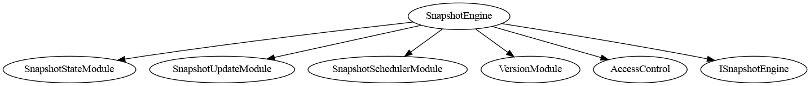
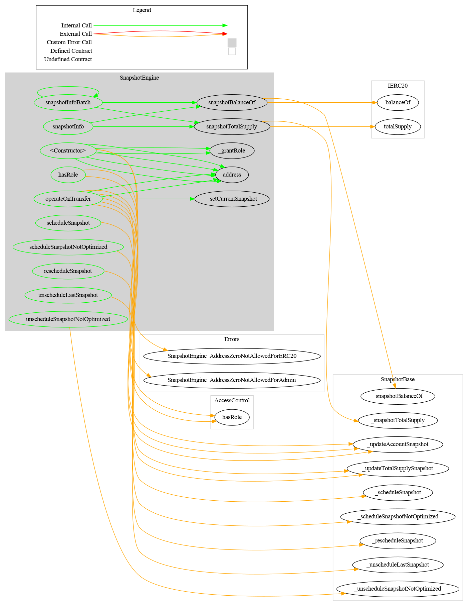
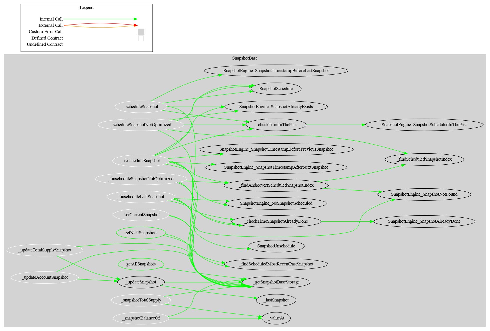

# SnapshotEngine

> This project is not audited
>
> If you want to use this project, perform your own verification or send an email to [admin@cmta.ch](mailto:admin@cmta.ch).

The **SnapshotEngine** is a contract to perform on-chain snapshot, useful to distribute dividends on-chain.

It is destined to be used with a standard ERC-20 contract (e.g CMTAT)

If you want to use it inside another contract, e.g. to distribute dividends on-chain, you can get the state regarding the balance with the functions defined in the interface `ISnapshotState` defined in [./contracts/interface/ISnapshotState.sol](./contracts/interface/ISnapshotState.sol)


### How to include it

While it has been designed for the CMTAT, the snapshotEngine can be used with others ERC-20 contracts to perform on-chain snapshot

For that, the only thing to do is to import in your contract the interface `ISnapshotEngine` which declares the function `operateOnTransfer`

This interface can be found in [CMTAT/contracts/interfaces/engine](https://github.com/CMTA/CMTAT/tree/master/contracts/interfaces/engine)

```solidity
/*
* @dev minimum interface to define a SnapshotEngine
*/
interface ISnapshotEngine {
    /**
     * @dev Returns true if the operation is a success, and false otherwise.
     */
    function operateOnTransfer(address from, address to, uint256 balanceFrom, uint256 balanceTo, uint256 totalSupply) external;
   
}
```

After each ERC-20 transfer, your contract must call the function `operateOnTransfer` which is the entrypoint for the SnapshotEngine.

## Schema

### Inheritance




### Graph

#### SnapshotEngine




#### SnapshotBase




## Usage instructions

### Dependencies

The toolchain includes the following components, where the versions
are the latest ones that we tested: 

- npm 10.2.5
- Hardhat ^2.22.7
- Solidity 0.8.28 (via solc-js)
- Node 20.5.0
- CMTAT [v3.0.0-rc2](https://github.com/CMTA/CMTAT/releases/tag/v3.0.0-rc2)
- OpenZeppelin Contracts (Node.js module) [v5.3.0](https://github.com/OpenZeppelin/openzeppelin-contracts/releases/tag/v5.3.0) 
- OpenZeppelin Contracts Upgradeable (Node.js module) [v5.3.0](https://github.com/OpenZeppelin/openzeppelin-contracts-upgradeable/releases/tag/v5.3.0) (to compile CMTAT)


### Installation

- Clone the repository

Clone the git repository, with the option `--recurse-submodules` to fetch the submodules:

`git clone git@github.com:CMTA/SnapshotEngine.git  --recurse-submodules`  

- Node.js version

We recommend to install the [Node Version Manager `nvm`](https://github.com/nvm-sh/nvm) to manage multiple versions of Node.js on your machine. You can then, for example, install the version 20.5.0 of Node.js with the following command: `nvm install 20.5.0`

The file [.nvmrc](../.nvmrc) at the root of the project set the Node.js version. `nvm use`will automatically use this version if no version is supplied on the command line.

- node modules

To install the node modules required by SnapshotEngine, run the following command at the root of the project:

`npm install`

### Hardhat

> To use Hardhat, the recommended way is to use the version installed as
> part of the node modules, via the `npx` command:

`npx hardhat`

Alternatively, you can install Hardhat [globally](https://hardhat.org/hardhat-runner/docs/getting-started):

`npm install -g hardhat` 

See Hardhat's official [documentation](https://hardhat.org) for more information.

#### Contract size

You can get the size of the contract by running the following commands.

- Compile the contracts:

```bash
npx hardhat compile
```

- Run the script:

```bash
npm run-script size
```

The script calls the plugin [hardhat-contract-sizer](https://www.npmjs.com/package/hardhat-contract-sizer) with Hardhat.

#### Testing

Tests are written in JavaScript by using [web3js](https://web3js.readthedocs.io/en/v1.10.0/) and run **only** with Hardhat as follows:

`npx hardhat test`

To use the global hardhat install, use instead `hardhat test`.

Please see the Hardhat [documentation](https://hardhat.org/tutorial/testing-contracts) for more information about the writing and running of  Hardhat.


#### Code style guidelines

We use linters to ensure consistent coding style. If you contribute code, please run this following command: 

For JavaScript:

```bash
npm run-script lint:js 
npm run-script lint:js:fix 
```

For Solidity:

```bash
npm run-script lint:sol  
npm run-script lint:sol:fix
```

## Generate documentation

### [Surya](https://github.com/ConsenSys/surya)

To generate documentation with surya, you can call the three bash scripts in [doc/script](./doc/script)

| Task                 | Script                      | Command exemple                                              |
| -------------------- | --------------------------- | ------------------------------------------------------------ |
| Generate graph       | script_surya_graph.sh       | npx surya graph -i contracts/**/*.sol <br />npx surya graph contracts/SnapshotEngine.sol |
| Generate inheritance | script_surya_inheritance.sh | npx surya inheritance contracts/modules/SnapshotEngine.sol -i <br />npx surya inheritance contracts/modules/SnapshotEngine.sol |
| Generate report      | script_surya_report.sh      | npx surya mdreport -i surya_report.md contracts/modules/SnapshotEngine.sol <br />npx surya mdreport surya_report.md contracts/modules/SnapshotEngine.sol |

In the report, the path for the different files are indicated in absolute. You have to remove the part which correspond to your local filesystem.


### [Coverage](https://github.com/sc-forks/solidity-coverage/)

Code coverage for Solidity smart-contracts, installed as a hardhat plugin

```bash
npm run-script coverage
```


### [Slither](https://github.com/crytic/slither)

Slither is a Solidity static analysis framework written in Python3

```bash
slither .  --checklist --filter-paths "openzeppelin-contracts-upgradeable|openzeppelin-contracts|@openzeppelin|test|CMTAT" > slither-report.md
```

### Docgen (Solidity API)

```solidity
npm run-script docgen
```


## Further reading

You can find a prototype to distribute on-chain dividend based on on-chain snapshot here:

- [Taurus - Equity Tokenization: How to Pay Dividend On-Chain Using CMTAT](https://www.taurushq.com/blog/equity-tokenization-how-to-pay-dividend-on-chain-using-cmtat/)
- [CMTAT IncomeVault](https://github.com/CMTA/IncomeVault)

Note that this project used snapshots when they were performed directly inside CMTAT, see [CMTAT v2.4.0](https://github.com/CMTA/CMTAT/releases/tag/v2.4.0), not through the SnapshotEngine but the principle is similar.

## Intellectual property

The code is copyright (c) Capital Market and Technology Association, 2018-2025, and is released under [Mozilla Public License 2.0](./LICENSE.md).
