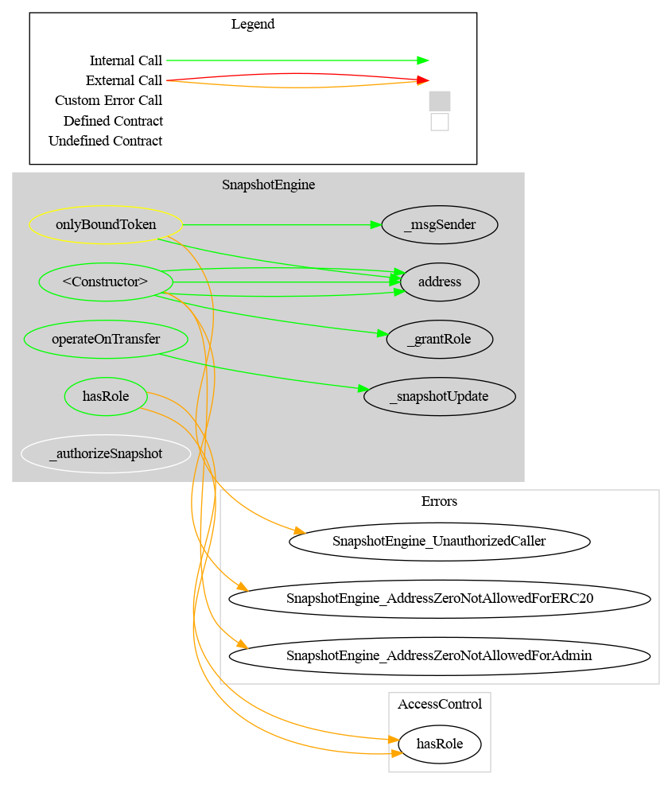

# SnapshotEngine

> This project is not audited
>
> If you want to use this project, perform your own verification or send an email to [admin@cmta.ch](mailto:admin@cmta.ch).

The **SnapshotEngine** is a contract to perform on-chain snapshot, useful to distribute dividends on-chain.

It is destined to be used with a standard ERC-20 contract (e.g CMTAT)

If you want to use it inside another contract, e.g. to distribute dividends on-chain, you can get the state regarding the balance with the functions defined in the interface `ISnapshotState` defined in [./contracts/interface/ISnapshotState.sol](./contracts/interface/ISnapshotState.sol)

[TOC]

### How to include it

While it has been designed for the CMTAT, the snapshotEngine can be used with others ERC-20 contracts to perform on-chain snapshot

For that, the only thing to do is to import in your contract the interface `ISnapshotEngine` which declares the function `operateOnTransfer`

This interface can be found in [CMTAT/contracts/interfaces/engine](https://github.com/CMTA/CMTAT/tree/master/contracts/interfaces/engine)

```solidity
/*
* @dev minimum interface to define a SnapshotEngine
*/
interface ISnapshotEngine {
   /**
    * @notice Records balance and total supply snapshots before any token transfer occurs.
    * @dev This function should be called inside the {_beforeTokenTransfer} hook so that
    * snapshots are updated prior to any state changes from {_mint}, {_burn}, or {_transfer}.
    * It ensures historical balances and total supply remain accurate for snapshot queries.
    *
    * @param from The address tokens are being transferred from (zero address if minting).
    * @param to The address tokens are being transferred to (zero address if burning).
    * @param balanceFrom The current balance of `from` before the transfer (used to update snapshot).
    * @param balanceTo The current balance of `to` before the transfer (used to update snapshot).
    * @param totalSupply The current total supply before the transfer (used to update snapshot).
    */
    function operateOnTransfer(address from, address to, uint256 balanceFrom, uint256 balanceTo, uint256 totalSupply) external;
}
```

During each ERC-20 transfer, before updating the balances and total supply, your contract must call the function `operateOnTransfer` which is the entrypoint for the SnapshotEngine.

## Schema

### Inheritance


### Graph

#### SnapshotEngine




#### SnapshotBase


## Technical

### Complexity

| Name                                                         | Function                               | Description                                                  | Implemented [yes, no] | Complexity                                                   | Best case | Worst case  |
| ------------------------------------------------------------ | -------------------------------------- | ------------------------------------------------------------ | --------------------- | ------------------------------------------------------------ | --------- | ----------- |
| Schedule snasphot in the future, after all current snapshots | `scheduleSnapshot`                     | -                                                            | &#x2611;              | O(1)                                                         |           |             |
| Schedule a snapshot at a random place in the future          | `scheduleSnapshotNotOptimized`         | -                                                            | &#x2611;              | O(N)                                                         | O(1)      | O(N)        |
| Schedule snasphot in the past                                | -                                      | -                                                            | &#x2612;              | O(N)                                                         | O(1)      | O(N)        |
| Reschedule a snapshot (in the future)                        | `_rescheduleSnapshot`                  | The new time is in the range between the previous snapshot and the next snapshot | &#x2611;              | O(1)                                                         |           |             |
| Reschedule a snapshot (in the future)                        | -                                      | The new time can be after or before another existent snapshot | &#x2612;              | O(N)                                                         | O(1)      | O(N)        |
| Reschedule a snapshot (in the past)                          | -                                      | The new time can be in the past                              | &#x2612;              | -                                                            |           |             |
| Unschedule the last snapshot                                 | `_unscheduleSnapshot`                  | -                                                            | &#x2611;              | O(1)                                                         |           |             |
| Unschedule a random snapshot in the past                     | `_unscheduleNotOptimized`              | -                                                            | &#x2611;              | O(N)                                                         | O(1)      | O(N)        |
| Unschedule a random snapshot in the future                   | `_unscheduleNotOptimized `             | -                                                            | &#x2611;              | O(N)                                                         | O(1)      | O(N)        |
| Set the current snapshot                                     | `_setCurrentSnapshot`                  | -                                                            | &#x2611;              | Same as `_findScheduledMostRecentPastSnapshot`               |           |             |
| Update snapshots of the balance of an account                | `_updateAccountSnapshot`               | -                                                            | &#x2611;              | Same as `_updateSnapshot`                                    |           |             |
| Update snapshots of the total Supply                         | `_updateTotalSupplySnapshot`           | -                                                            | &#x2611;              | Same as `_updateSnapshot`                                    |           |             |
| Get the last snapshot time inside a snapshot ids array       | `_lastSnapshot`                        | -                                                            | &#x2611;              | O(1)                                                         |           |             |
| Find a snapshot                                              | `_findScheduledSnapshotIndex`          | Find the snapshot index at the specified time                | &#x2611;              | O(log2(N)) 		<br />We use a binary search to find the value at the specified time |           |             |
| Find the mot recent past snapshot                            | `_findScheduledMostRecentPastSnapshot` | -                                                            | &#x2611;              | O(1) 		<br />We only have a O(N) complexity (worst case) if all next scheduled snapshot are situated in the past but no update of the current snapshot has been made. | O(1)      | O(N) <br /> |
| Update balance and/or total supply snapshots before the values are 		modified | `_update` <br /><br />`transferred`    | Call before each transfer. 		  			 It is very important to have a low complexity because this 		function is called very often. | &#x2611;              | The complexity depends of th functions `_setCurrentSnapshot` 		`_updateAccountSnapshot`		`_updateTotalSupplySnapshot` |           |             |
| Get the next scheduled snapshotd                             | `getNextSnapshots`                     | -                                                            | &#x2611;              | O(N) 		<br />Nevertheless, we maintain a pointer on the actual snapshot to avoid loop through past snapshot |           |             |
| Get all snapshot                                             | `getAllSnapshots`                      | -                                                            | &#x2611;              | O(1) 		<br />We directly return the array              |           |             |
| Get the balance of an tokenHolder st the time specified      | `snapshotBalanceOf`                    | Return the number of tokens owned by the given tokenHolder at the time when the snapshot with the given time was created. | &#x2611;              | O(log2(N)) 		<br />We use a binary search to find the value at the snapshot time |           |             |
| Get the total supply at the time specified                   | `snapshotTotalSupply`                  | -                                                            | &#x2611;              | O(log2(N)) 		<br />We use a binary search to find the value at the snapshot time |           |             |

## Schema

Here are several schema to explain the main functions

### Get next snapshot


### Schedule a snapshot


### Reschedule a snapshot


### Unschedule a snapshot


## Ethereum API

### ISnapshotBase

Base interface for snapshot engines, providing common errors and read-only functions to query snapshots.

------

#### Events

##### SnapshotSchedule(uint256, uint256)

```solidity
SnapshotSchedule(uint256 indexed oldTime, uint256 indexed newTime)
```

Emitted when a snapshot is scheduled for the first time or rescheduled.

**Input Parameters:**

| Name    | Type    | Description                                              |
| ------- | ------- | -------------------------------------------------------- |
| oldTime | uint256 | The previous scheduled timestamp (0 if newly scheduled). |
| newTime | uint256 | The new scheduled timestamp for the snapshot.            |

------

##### SnapshotUnschedule(uint256)

```solidity
SnapshotUnschedule(uint256 indexed time)
```

Emitted when a previously scheduled snapshot is canceled.

**Input Parameters:**

| Name | Type    | Description                                         |
| ---- | ------- | --------------------------------------------------- |
| time | uint256 | The timestamp of the snapshot that was unscheduled. |

------

#### Errors

##### SnapshotEngine_SnapshotScheduledInThePast(uint256, uint256)

```solidity
SnapshotEngine_SnapshotScheduledInThePast(uint256 time, uint256 timestamp)
```

Thrown when attempting to schedule a snapshot at a time earlier than the current block timestamp.

**Input Parameters:**

| Name      | Type    | Description                  |
| --------- | ------- | ---------------------------- |
| time      | uint256 | The snapshot time requested. |
| timestamp | uint256 | The current block timestamp. |

------

##### SnapshotEngine_SnapshotTimestampBeforeLastSnapshot(uint256, uint256)

```solidity
SnapshotEngine_SnapshotTimestampBeforeLastSnapshot(uint256 time, uint256 lastSnapshotTimestamp)
```

Thrown when a snapshot timestamp is earlier than the last snapshot timestamp.

**Input Parameters:**

| Name                  | Type    | Description                                |
| --------------------- | ------- | ------------------------------------------ |
| time                  | uint256 | The snapshot time requested.               |
| lastSnapshotTimestamp | uint256 | The timestamp of the most recent snapshot. |

------

##### SnapshotEngine_SnapshotTimestampAfterNextSnapshot(uint256, uint256)

```solidity
SnapshotEngine_SnapshotTimestampAfterNextSnapshot(uint256 time, uint256 nextSnapshotTimestamp)
```

Thrown when a snapshot timestamp is later than the next scheduled snapshot timestamp.

**Input Parameters:**

| Name                  | Type    | Description                                   |
| --------------------- | ------- | --------------------------------------------- |
| time                  | uint256 | The snapshot time requested.                  |
| nextSnapshotTimestamp | uint256 | The timestamp of the next scheduled snapshot. |

------

##### SnapshotEngine_SnapshotTimestampBeforePreviousSnapshot(uint256,uint256)

```solidity
SnapshotEngine_SnapshotTimestampBeforePreviousSnapshot(uint256 time, uint256 previousSnapshotTimestamp)
```

Thrown when a snapshot timestamp is earlier than the previous snapshot timestamp.

**Input Parameters:**

| Name                      | Type    | Description                             |
| ------------------------- | ------- | --------------------------------------- |
| time                      | uint256 | The snapshot time requested.            |
| previousSnapshotTimestamp | uint256 | The timestamp of the previous snapshot. |

------

##### SnapshotEngine_SnapshotAlreadyExists()

Thrown when attempting to schedule a snapshot that already exists.

------

##### SnapshotEngine_SnapshotAlreadyDone()

Thrown when attempting to execute or schedule a snapshot that has already been taken.

------

##### SnapshotEngine_NoSnapshotScheduled()

Thrown when attempting to unschedule or interact with a snapshot when no snapshot is currently scheduled.

------

##### SnapshotEngine_SnapshotNotFound()

Thrown when querying or modifying a snapshot that cannot be found.

------

#### Functions

##### getAllSnapshots() -> (uint256[] memory)

Get all snapshots that have been created.

**Return Values:**

| Name      | Type      | Description                                    |
| --------- | --------- | ---------------------------------------------- |
| snapshots | uint256[] | Array of timestamps of all existing snapshots. |

------

##### getNextSnapshots() -> (uint256[] memory)

Get the next scheduled snapshots that have not yet been created.

**Return Values:**

| Name          | Type      | Description                                            |
| ------------- | --------- | ------------------------------------------------------ |
| nextSnapshots | uint256[] | Array of timestamps of all future scheduled snapshots. |

### SnapshotScheduler

**Abstract contract for scheduling, rescheduling, and canceling snapshots.**
 Provides methods to manage snapshot times (expressed in seconds since epoch) with role-based access control via `SNAPSHOOTER_ROLE`.

------

#### Functions

##### scheduleSnapshot(uint256)

```solidity
function scheduleSnapshot(uint256 time) 
public onlyRole(SNAPSHOOTER_ROLE)
```

Schedules a snapshot at the given time (in seconds since epoch).

**Details:**

- The scheduled time cannot be before the latest scheduled but not yet created snapshot.
- Access is restricted to accounts with `SNAPSHOOTER_ROLE`.

**Input Parameters:**

| Name | Type    | Description                         |
| ---- | ------- | ----------------------------------- |
| time | uint256 | The scheduled time of the snapshot. |

------

##### scheduleSnapshotNotOptimized(uint256) 

```solidity
function scheduleSnapshotNotOptimized(uint256 time) 
public onlyRole(SNAPSHOOTER_ROLE)
```

Schedules a snapshot at the given time (non-optimized version).

**Details:**

- The scheduled time cannot be before the latest scheduled but not yet created snapshot.
- Access is restricted to accounts with `SNAPSHOOTER_ROLE`.

**Input Parameters:**

| Name | Type    | Description                         |
| ---- | ------- | ----------------------------------- |
| time | uint256 | The scheduled time of the snapshot. |

------

##### rescheduleSnapshot(uint256 oldTime, uint256 newTime)

```solidity
function rescheduleSnapshot(uint256 oldTime,uint256 newTime) 
public onlyRole(SNAPSHOOTER_ROLE)
```

Reschedules a snapshot from `oldTime` to `newTime`.

**Details:**

- The new time cannot be before the previous scheduled snapshot or after the next scheduled snapshot.
- Access is restricted to accounts with `SNAPSHOOTER_ROLE`.

**Input Parameters:**

| Name    | Type    | Description                                  |
| ------- | ------- | -------------------------------------------- |
| oldTime | uint256 | The original scheduled time of the snapshot. |
| newTime | uint256 | The new scheduled time of the snapshot.      |

------

##### unscheduleLastSnapshot(uint256 time)

```solidity
function unscheduleLastSnapshot(uint256 time) 
public onlyRole(SNAPSHOOTER_ROLE)
```

Cancels the creation of the last scheduled snapshot at the given time.

**Details:**

- There must not be any other snapshots scheduled after this one.
- Access is restricted to accounts with `SNAPSHOOTER_ROLE`.

**Input Parameters:**

| Name | Type    | Description                                   |
| ---- | ------- | --------------------------------------------- |
| time | uint256 | The scheduled time of the snapshot to cancel. |

------

##### unscheduleSnapshotNotOptimized(uint256 time)

```solidity
function unscheduleSnapshotNotOptimized(uint256 time) 
public onlyRole(SNAPSHOOTER_ROLE)
```

Cancels the creation of a scheduled snapshot at the given time (non-optimized version).

**Details:**

- Access is restricted to accounts with `SNAPSHOOTER_ROLE`.

**Input Parameters:**

| Name | Type    | Description                                   |
| ---- | ------- | --------------------------------------------- |
| time | uint256 | The scheduled time of the snapshot to cancel. |


### SnapshotState

**Minimal interface for contracts (e.g. SnapshotEngine or CMTAT) supporting historical balance and total supply queries using snapshots.**
 Provides read-only methods to retrieve account balances and total token supply at specific timestamps, either individually or in batch.

------

#### Functions

##### snapshotBalanceOf(uint256, address) ->  (uint256)

```solidity
function snapshotBalanceOf(uint256 time,address tokenHolder) 
external view returns (uint256 tokenHolderBalance);
```

Gets the balance of a specific account at the snapshot corresponding to a given timestamp.

**Input Parameters:**

| Name        | Type    | Description                                      |
| ----------- | ------- | ------------------------------------------------ |
| time        | uint256 | The timestamp identifying the snapshot to query. |
| tokenHolder | address | The address whose balance is being requested.    |

**Return Values:**

| Name    | Type    | Description                                                  |
| ------- | ------- | ------------------------------------------------------------ |
| balance | uint256 | The recorded balance at the snapshot, or the current balance if no snapshot exists for that timestamp. |

------

##### snapshotTotalSupply(uint256) ->  (uint256)

```solidity
function snapshotTotalSupply(uint256 time) 
public view override(ISnapshotState) 
returns (uint256 totalSupply)
```

Gets the total token supply at the snapshot corresponding to a given timestamp.

**Input Parameters:**

| Name | Type    | Description                                      |
| ---- | ------- | ------------------------------------------------ |
| time | uint256 | The timestamp identifying the snapshot to query. |

**Return Values:**

| Name   | Type    | Description                                                  |
| ------ | ------- | ------------------------------------------------------------ |
| supply | uint256 | The recorded total supply at the snapshot, or the current total supply if no snapshot exists for that timestamp. |

------

##### snapshotInfo(uint256, address) ->  (uint256, uint256)

```solidity
function snapshotInfo(uint256 time, address tokenHolder) 
public view override(ISnapshotState) 
returns (uint256 tokenHolderBalance, uint256 totalSupply)
```

Retrieves both an account's balance and the total supply at the snapshot for a given timestamp in a single call.

**Input Parameters:**

| Name        | Type    | Description                                      |
| ----------- | ------- | ------------------------------------------------ |
| time        | uint256 | The timestamp identifying the snapshot to query. |
| tokenHolder | address | The address whose balance is being requested.    |

**Return Values:**

| Name               | Type    | Description                                                  |
| ------------------ | ------- | ------------------------------------------------------------ |
| tokenHolderBalance | uint256 | The recorded balance of the tokenHolder at the snapshot, or current balance if no snapshot exists. |
| totalSupply        | uint256 | The recorded total supply at the snapshot, or current total supply if no snapshot exists. |

------

##### snapshotInfoBatch(uint256, address[]) ->  (uint256[], uint256)

```solidity
function snapshotInfoBatch(uint256 time, address[] calldata addresses) 
public view override(ISnapshotState) 
returns (uint256[] memory tokenHolderBalances, uint256 totalSupply)
```

Retrieves balances of multiple accounts and the total supply at a snapshot for a given timestamp in a single call.

**Input Parameters:**

| Name      | Type      | Description                                      |
| --------- | --------- | ------------------------------------------------ |
| time      | uint256   | The timestamp identifying the snapshot to query. |
| addresses | address[] | The array of addresses to query balances for.    |

**Return Values:**

| Name                | Type      | Description                                                  |
| ------------------- | --------- | ------------------------------------------------------------ |
| tokenHolderBalances | uint256[] | Array containing each address's balance at the snapshot, or current balance if no snapshot exists. |
| totalSupply         | uint256   | The recorded total supply at the snapshot, or current total supply if no snapshot exists. |

------

##### snapshotInfoBatch(uint256[], address[]) -> (uint256, uint256)

```solidity
function snapshotInfoBatch(uint256[] calldata times, address[] calldata addresses) 
public view override(ISnapshotState) 
returns (uint256[][] memory tokenHolderBalances, uint256[] memory totalSupply)
```

Retrieves balances of multiple accounts at multiple snapshots, as well as the total supply at each snapshot.

**Input Parameters:**

| Name      | Type      | Description                                                |
| --------- | --------- | ---------------------------------------------------------- |
| times     | uint256[] | Array of timestamps identifying each snapshot to query.    |
| addresses | address[] | Array of addresses to query balances for at each snapshot. |

**Return Values:**

| Name                | Type        | Description                                                  |
| ------------------- | ----------- | ------------------------------------------------------------ |
| tokenHolderBalances | uint256[][] | 2D array where each row corresponds to the balances of all provided addresses at a given snapshot. |
| totalSupplies       | uint256[]   | Array containing the total supply at each snapshot, or current supply if no snapshot exists. |

## Storage management (ERC-7201)

While SnapshotEngine can not be deployed with a proxy, modules implement [ERC-7201](https://eips.ethereum.org/EIPS/eip-7201) to allow them to be directly used by a potential CMTAT deployment version.

## Usage instructions

### Dependencies

The toolchain includes the following components, where the versions
are the latest ones that we tested: 

- Development

  - npm 10.2.5
  - Hardhat ^2.22.7
  - Node 20.5.0

- Compilation

  - Solidity [v0.8.30](https://docs.soliditylang.org/en/v0.8.30/)

  - CMTAT [v3.0.0-rc7](https://github.com/CMTA/CMTAT/releases/tag/v3.0.0-rc7)

  - OpenZeppelin

    - OpenZeppelin Contracts (Node.js module) [v5.4.0](https://github.com/OpenZeppelin/openzeppelin-contracts/releases/tag/v5.4.0) 

    - OpenZeppelin Contracts Upgradeable (Node.js module) [v5.4.0](https://github.com/OpenZeppelin/openzeppelin-contracts-upgradeable/releases/tag/v5.4.0) (to compile CMTAT)


### Installation

- Clone the repository

Clone the git repository, with the option `--recurse-submodules` to fetch the submodules:

`git clone git@github.com:CMTA/SnapshotEngine.git  --recurse-submodules`  

- Node.js version

We recommend to install the [Node Version Manager `nvm`](https://github.com/nvm-sh/nvm) to manage multiple versions of Node.js on your machine. You can then, for example, install the version 20.5.0 of Node.js with the following command: `nvm install 20.5.0`

The file [.nvmrc](../.nvmrc) at the root of the project set the Node.js version. `nvm use`will automatically use this version if no version is supplied on the command line.

- node modules

To install the node modules required by SnapshotEngine, run the following command at the root of the project:

`npm install`

### Hardhat

> To use Hardhat, the recommended way is to use the version installed as
> part of the node modules, via the `npx` command:

`npx hardhat`

Alternatively, you can install Hardhat [globally](https://hardhat.org/hardhat-runner/docs/getting-started):

`npm install -g hardhat` 

See Hardhat's official [documentation](https://hardhat.org) for more information.

#### Contract size

You can get the size of the contract by running the following commands.

- Compile the contracts:

```bash
npx hardhat compile
```

- Run the script:

```bash
npm run-script size
```

The script calls the plugin [hardhat-contract-sizer](https://www.npmjs.com/package/hardhat-contract-sizer) with Hardhat.

#### Testing

Tests are written in JavaScript by using [web3js](https://web3js.readthedocs.io/en/v1.10.0/) and run **only** with Hardhat as follows:

`npx hardhat test`

To use the global hardhat install, use instead `hardhat test`.

Please see the Hardhat [documentation](https://hardhat.org/tutorial/testing-contracts) for more information about the writing and running of  Hardhat.


#### Code style guidelines

We use linters to ensure consistent coding style. If you contribute code, please run this following command: 

For JavaScript:

```bash
npm run-script lint:js 
npm run-script lint:js:fix 
```

For Solidity:

```bash
npm run-script lint:sol  
npm run-script lint:sol:fix
```

## Generate documentation

### [Surya](https://github.com/ConsenSys/surya)

To generate documentation with surya, you can call the three bash scripts in [doc/script](./doc/script)

| Task                 | Script                      | Command exemple                                              |
| -------------------- | --------------------------- | ------------------------------------------------------------ |
| Generate graph       | script_surya_graph.sh       | npx surya graph -i contracts/**/*.sol <br />npx surya graph contracts/SnapshotEngine.sol |
| Generate inheritance | script_surya_inheritance.sh | npx surya inheritance contracts/modules/SnapshotEngine.sol -i <br />npx surya inheritance contracts/modules/SnapshotEngine.sol |
| Generate report      | script_surya_report.sh      | npx surya mdreport -i surya_report.md contracts/modules/SnapshotEngine.sol <br />npx surya mdreport surya_report.md contracts/modules/SnapshotEngine.sol |

In the report, the path for the different files are indicated in absolute. You have to remove the part which correspond to your local filesystem.


### [Coverage](https://github.com/sc-forks/solidity-coverage/)

Code coverage for Solidity smart-contracts, installed as a hardhat plugin

```bash
npm run-script coverage
```


### Docgen (Solidity API)

```solidity
npm run-script docgen
```


## Security

### Vulnerability disclosure

Please see [SECURITY.md](https://github.com/CMTA/CMTAT/blob/master/SECURITY.md) (CMTAT main repository).

### Audit

This project is not audited !

### Tools

#### [Slither](https://github.com/crytic/slither)

Slither is a Solidity static analysis framework written in Python3

```bash
slither .  --checklist --filter-paths "openzeppelin-contracts-upgradeable|openzeppelin-contracts|@openzeppelin|test|CMTAT|mock" > slither-report.md
```


#### Aderyn

Here is the list of report performed with [Aderyn](https://github.com/Cyfrin/aderyn)

```bash
aderyn -x mock --output aderyn-report.md
```


## Further reading

You can find a prototype to distribute on-chain dividend based on on-chain snapshot here:

- [Taurus - Equity Tokenization: How to Pay Dividend On-Chain Using CMTAT](https://www.taurushq.com/blog/equity-tokenization-how-to-pay-dividend-on-chain-using-cmtat/)
- [CMTAT IncomeVault](https://github.com/CMTA/IncomeVault)

Note that this project used snapshots when they were performed directly inside CMTAT, see [CMTAT v2.4.0](https://github.com/CMTA/CMTAT/releases/tag/v2.4.0), not through the `SnapshotEngine` but the principle is similar.

## Intellectual property

The code is copyright (c) Capital Market and Technology Association, 2018-2025, and is released under [Mozilla Public License 2.0](./LICENSE.md).
